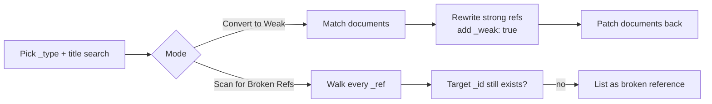

# sanity-convert-references

> Reference optimization utility for Sanity Studio — convert strong references to weak references for any document types, and scan for broken references.

[](https://www.npmjs.com/package/@liiift-studio/sanity-convert-references)
[](https://www.npmjs.com/package/@liiift-studio/sanity-convert-references)
[](https://www.sanity.io/)

A Sanity Studio desk-tool panel that bulk-rewrites a document's **strong** references into **weak** references (`_weak: true`), and a companion scanner that finds references whose target no longer exists. Use it when a strong reference is blocking a delete/unpublish, or to audit a dataset for orphaned references.

<p align="center">
	
</p>

A **strong** reference is referentially enforced — Sanity will not let you delete or unpublish a document while another document still strongly references it. A **weak** reference relaxes that constraint: the target can be deleted, and the reference is simply left dangling. Converting strong → weak is how you break those publish/delete locks for non-critical relationships.

---

## Install

```bash
npm install @liiift-studio/sanity-convert-references
```

> Published as **`@liiift-studio/sanity-convert-references`** (scoped). The default export is the React component `ConvertToWeakReferences`.

### Requirements

| Peer dependency | Supported range |
|---|---|
| `sanity`        | `^3.0.0 \|\| ^4.0.0 \|\| ^5.0.0` |
| `@sanity/ui`    | `^1.0.0 \|\| ^2.0.0 \|\| ^3.0.0` |
| `@sanity/icons` | `^2.0.0 \|\| ^3.0.0` |
| `react`         | `^18.0.0 \|\| ^19.0.0` |

---

## Usage

The component renders a panel and needs a configured Sanity `client` passed as a prop. The simplest way to surface it is as a custom desk/structure tool.

```jsx
import {ConvertToWeakReferences} from '@liiift-studio/sanity-convert-references'
import {useClient} from 'sanity'

function ReferenceTools() {
	// Use an API version your dataset supports
	const client = useClient({apiVersion: '2024-01-01'})
	return <ConvertToWeakReferences client={client} />
}
```

Register it as a custom tool in your Studio config so it shows up in the top navigation:

```ts
// sanity.config.ts
import {defineConfig} from 'sanity'
import {WrenchIcon} from '@sanity/icons'
import {ReferenceTools} from './ReferenceTools'

export default defineConfig({
	// ...projectId, dataset, plugins...
	tools: (prev) => [
		...prev,
		{name: 'reference-tools', title: 'Reference Tools', icon: WrenchIcon, component: ReferenceTools},
	],
})
```

Open it from the Studio. From there you choose a document type, search by title, and run either operation mode.

### Props

| Prop                  | Type                       | Required | Description |
|-----------------------|----------------------------|----------|-------------|
| `client`              | `SanityClient`             | yes      | Configured Sanity client used for all fetches and patches. |
| `displayName`         | `string`                   | no       | Heading shown at the top of the panel. |
| `icon`                | `React.ComponentType`      | no       | Icon rendered next to the heading. |
| `dangerMode`          | `boolean`                  | no       | Whether destructive actions are unlocked (the **Convert** button only appears when `true`). |
| `onDangerModeChange`  | `(utilityId, next) => void`| no       | Called when the lock toggle flips danger mode; wire this to your own state if you manage danger mode externally. |
| `utilityId`           | `string`                   | no       | Identifier passed back to `onDangerModeChange`. |

---

## Two modes

The panel has a mode switch at the top:

### 1. Convert to Weak

Finds documents of the selected `_type` whose `title` matches your search prefix, and rewrites their strong references to weak ones. The actual **Convert** button is hidden until you unlock **danger mode** (the lock toggle, top-right), which raises a confirmation modal first.

### 2. Scan for Broken Refs

Recursively walks each matched document, and for every `_ref` it fetches the target to confirm it still exists. Any reference pointing at a deleted/missing `_id` is listed — with the document, field path, the missing ID, and whether the broken reference was strong or weak — each linking back to the document in the Studio. This mode is read-only.



---

## How conversion works (and its limits)

Convert mode fetches the matched documents, serialises them, performs a global replacement of every `"_type":"reference"` occurrence with `"_type":"reference","_weak":true`, and patches each document back via `client.patch(...).set(...).commit()`.

Be aware of the implications before running it:

- **It is a bulk mutation with no built-in undo.** Patches are committed directly to your dataset. **Export / back up first** (`sanity dataset export`).
- **The replacement is string-based, not path-scoped.** Every reference object in a matched document is converted, including nested ones — it is not selective per field.
- **Search and type are interpolated directly into the GROQ query string** (e.g. `title match "${value}*"`), not passed as parameters — treat the search box as a trusted, admin-only input.
- **Search is by `title` prefix** and the type list is a **fixed dropdown** (`typeface`, `collection`, `pair`, `font`, `license`, `order`, `account`, `cart`, `page`, `blogpost`). If your schema uses other type names, you will need to adjust the source. The "any document types" capability refers to the conversion mechanism, not an open type picker out of the box.
- Convert is intentionally gated behind danger mode + a confirmation dialog for this reason.

> ⚠️ **Run against a backup or a non-production dataset first.** Weak references do not block deletion, so converting them changes the referential-integrity guarantees of your content.

---

## Repository

- **Source & issues:** https://github.com/Liiift-Studio/sanity-convert-references
- Part of the [Liiift Studio Sanity tools](https://github.com/Liiift-Studio) suite.

## License

MIT © Quinn Keaveney
