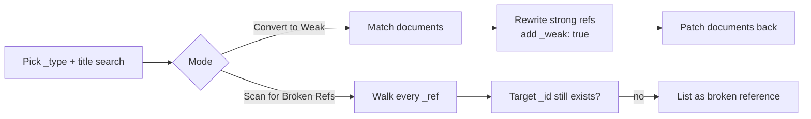

# sanity-convert-references

> Reference optimization utility for Sanity Studio — convert strong references to weak references for any document types, and scan for broken references.

[](https://www.npmjs.com/package/@liiift-studio/sanity-convert-references)
[](https://www.npmjs.com/package/@liiift-studio/sanity-convert-references)
[](https://www.sanity.io/)


A Sanity Studio desk-tool panel that bulk-rewrites a document's **strong** references into **weak** references (`_weak: true`), and a companion scanner that finds references whose target no longer exists. Use it when a strong reference is blocking a delete/unpublish, or to audit a dataset for orphaned references.

<p align="center">
	
</p>

A **strong** reference is referentially enforced — Sanity will not let you delete or unpublish a document while another document still strongly references it. A **weak** reference relaxes that constraint: the target can be deleted, and the reference is simply left dangling. Converting strong → weak is how you break those publish/delete locks for non-critical relationships.

---

## Blast radius

The **Scan** mode is read-only and safe. The **Convert** mode is a bulk mutation.
Read this before running Convert against a dataset you care about.

| Question | Answer |
|---|---|
| **What does it mutate?** | **Every reference object in every matched document** gets `_weak: true` added. The patch sets the whole document back, not a targeted field path. |
| **Does it delete?** | **No.** This tool never deletes documents — but converting a reference to weak **removes the guard that was stopping something else from being deleted.** That is the point of the tool, and the lasting consequence of running it. |
| **Is it reversible?** | **Not by this tool.** There is no weak → strong mode. Reverting means stripping `_weak` yourself, or restoring from a `sanity dataset export` taken beforehand. |
| **Drafts or published?** | **Both.** The query is `*[_type == … && title match …]` with **no `!(_id in path('drafts.**'))` filter**, so drafts of matching documents are matched and patched alongside their published versions. |
| **Scope of a mistake** | Bounded by the type dropdown plus your `title` prefix — but *within* each matched document the conversion is total, including deeply nested references. |
| **Scan mode** | Read-only. It only fetches; it never patches. |

### Convert failures are silent

The patch is issued **without `await` and without a `.catch()`**:

```js
client.patch(item._id).set(item).commit()   // not awaited
```

The surrounding `try/catch` cannot catch an async rejection, so **a patch that
fails — permissions, validation, a network error — reports nothing.** The panel
will continue through the list and may still finish looking successful. Verify
the result in the Studio rather than trusting the on-screen message.

Relatedly, the "All Updated!" message is driven by an off-by-one counter
(`count == length - 1`), so it **never appears when exactly one document
matched**, and fires one document early otherwise. Absence of the message does
not mean the run failed.

### Scan can report false positives

Broken-reference detection resolves each target with `*[_id == $refId][0]`. A
reference whose target currently exists **only as a draft** (`drafts.<id>`) will
not resolve and is reported as broken even though publishing the draft would fix
it. Check flagged IDs in the Studio before deleting anything on the strength of a
scan.

---

## Install

```bash
npm install @liiift-studio/sanity-convert-references
```

> Published as **`@liiift-studio/sanity-convert-references`** (scoped). The default export is the React component `ConvertToWeakReferences`.

### Requirements

This package supports **Sanity Studio v3, v4, v5 and v6** from a single build.

| Peer dependency | Declared range | What that means |
|---|---|---|
| `sanity`        | `>=3 <7` | Studio **v3 through v6** |
| `@sanity/ui`    | `>=2 <5` | v2, v3, v4 — see the note below, `<5` is **correct** for Studio v6 |
| `@sanity/icons` | `>=2 <6` | v2 through v5 |
| `react`         | `^18.0.0 \|\| ^19.0.0` | React 18 or 19 |

> The `@sanity/ui` ceiling of `<5` looks like a mistake at a glance and is not.
> **Studio v6 ships `@sanity/ui` v4, not v5** — so `>=2 <5` covers every Studio
> major listed above.

### How one build spans four Studio majors

The two libraries made breaking changes that are invisible to the type-checker:

- **`@sanity/ui` v4** moved `Tooltip`, `Menu`, `MenuButton`, `MenuItem`, `Code`,
  `Popover`, `Autocomplete`, `Toast` and `useToast` out of the package root and
  into subpath entries.
- **`@sanity/icons` v5** removed every named `*Icon` export.

The trap is that **both packages still *declare* the removed names in their
`.d.ts`, typed as `never`.** A named import therefore type-checks cleanly,
compiles, ships — and then throws at runtime in the Studio.

So this package **imports no `@sanity/ui` or `@sanity/icons` symbol directly.**
Every primitive and icon is routed through
[`@liiift-studio/sanity-ui-compat`](https://www.npmjs.com/package/@liiift-studio/sanity-ui-compat),
which resolves the *installed* namespace at runtime and falls back to a plain DOM
element if a given primitive is absent. That indirection, not a version matrix in
CI, is what makes one artifact work across v3–v6.

> **How far this is actually verified.** v6 support rests on the declared peer
> ranges, a green build, and use in three in-house Studios. It has **not** been
> exercised broadly in a running Sanity 6 Studio — treat v6 as supported and
> lightly travelled, and please file an issue if you hit a gap.

---

## Usage

The component renders a panel and needs a configured Sanity `client` passed as a prop. The simplest way to surface it is as a custom desk/structure tool.

```jsx
// The component is the package's DEFAULT export — a named import resolves to
// `undefined` and React will throw "Element type is invalid" at render time.
import ConvertToWeakReferences from '@liiift-studio/sanity-convert-references'
import {useClient} from 'sanity'

export function ReferenceTools() {
	// Use an API version your dataset supports
	const client = useClient({apiVersion: '2024-01-01'})
	return <ConvertToWeakReferences client={client} />
}
```

Register it as a custom tool in your Studio config so it shows up in the top navigation:

```ts
// sanity.config.ts
import {defineConfig} from 'sanity'
import {WrenchIcon} from '@sanity/icons'
import {ReferenceTools} from './ReferenceTools'

export default defineConfig({
	// ...projectId, dataset, plugins...
	tools: (prev) => [
		...prev,
		{name: 'reference-tools', title: 'Reference Tools', icon: WrenchIcon, component: ReferenceTools},
	],
})
```

Open it from the Studio. From there you choose a document type, search by title, and run either operation mode.

### Props

| Prop                  | Type                       | Required | Description |
|-----------------------|----------------------------|----------|-------------|
| `client`              | `SanityClient`             | yes      | Configured Sanity client used for all fetches and patches. |
| `displayName`         | `string`                   | no       | Heading shown at the top of the panel. |
| `icon`                | `React.ComponentType`      | no       | Icon rendered next to the heading. |
| `dangerMode`          | `boolean`                  | no       | Whether destructive actions are unlocked (the **Convert** button only appears when `true`). |
| `onDangerModeChange`  | `(utilityId, next) => void`| no       | Called when the lock toggle flips danger mode; wire this to your own state if you manage danger mode externally. |
| `utilityId`           | `string`                   | no       | Identifier passed back to `onDangerModeChange`. |

---

## Two modes

The panel has a mode switch at the top:

### 1. Convert to Weak

Finds documents of the selected `_type` whose `title` matches your search prefix, and rewrites their strong references to weak ones. The actual **Convert** button is hidden until you unlock **danger mode** (the lock toggle, top-right), which raises a confirmation modal first.

### 2. Scan for Broken Refs

Recursively walks each matched document, and for every `_ref` it fetches the target to confirm it still exists. Any reference pointing at a deleted/missing `_id` is listed — with the document, field path, the missing ID, and whether the broken reference was strong or weak — each linking back to the document in the Studio. This mode is read-only.


```mermaid
flowchart LR
	A[Pick _type + title search] --> B{Mode}
	B -->|Convert to Weak| C[Match documents]
	C --> D[Rewrite strong refs<br/>add _weak: true]
	D --> E[Patch documents back]
	B -->|Scan for Broken Refs| F[Walk every _ref]
	F --> G[Target _id still exists?]
	G -->|no| H[List as broken reference]
```

---

## How conversion works (and its limits)

Convert mode fetches the matched documents, serialises them, performs a global replacement of every `"_type":"reference"` occurrence with `"_type":"reference","_weak":true`, and patches each document back via `client.patch(...).set(...).commit()`.

Be aware of the implications before running it:

- **It is a bulk mutation with no built-in undo.** Patches are committed directly to your dataset. **Export / back up first** (`sanity dataset export`).
- **The replacement is string-based, not path-scoped.** Every reference object in a matched document is converted, including nested ones — it is not selective per field.
- **Search and type are interpolated directly into the GROQ query string** (e.g. `title match "${value}*"`), not passed as parameters — treat the search box as a trusted, admin-only input.
- **Search is by `title` prefix** and the type list is a **fixed dropdown** (`typeface`, `collection`, `pair`, `font`, `license`, `order`, `account`, `cart`, `page`, `blogpost`). If your schema uses other type names, you will need to adjust the source. The "any document types" capability refers to the conversion mechanism, not an open type picker out of the box.
- Convert is intentionally gated behind danger mode + a confirmation dialog for this reason.

> ⚠️ **Run against a backup or a non-production dataset first.** Weak references do not block deletion, so converting them changes the referential-integrity guarantees of your content.

---

## Repository

- **Source & issues:** https://github.com/Liiift-Studio/sanity-convert-references
- Part of the [Liiift Studio Sanity tools](https://github.com/Liiift-Studio) suite.

## License

MIT © Quinn Keaveney
